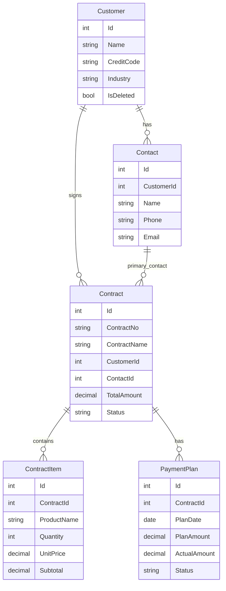
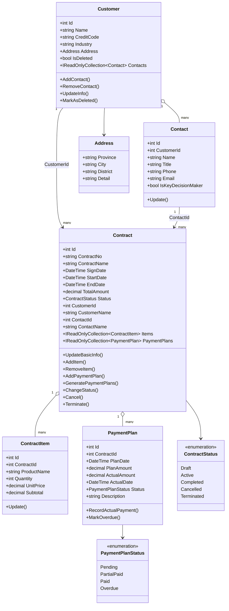

# 企业客户与合同管理系统（CRM Lite）领域模型说明

**文档版本**：V2.0  
**编写角色**：领域建模师  
**更新日期**：2026-06-29  
**分支**：Tycho_Code_Domain-modeler

## 一、项目领域背景

CRM Lite 面向制造企业的客户与合同台账管理场景，用 ASP.NET Core Web 系统替代分散的 Excel 表格。系统核心目标是统一维护客户、联系人、合同、合同明细与回款计划，保证客户资料、合同金额、回款进度和外键关系一致，提升查询、维护和协作效率。

## 二、需求分析总结

当前课程设计前期领域建模需要覆盖客户与合同两个核心业务链路。客户模块负责客户档案、统一社会信用代码、行业、地址、联系人等基础信息；合同模块负责合同编号、合同名称、签订日期、起止日期、客户、主联系人、合同金额、明细和回款计划。第 4 天重点是合同模块领域模型与数据库关系，为后续合同 CRUD、客户到联系人下拉联动提供稳定的数据结构。

## 三、限界上下文划分

1. 客户上下文：管理 Customer 聚合及其 Contact 实体、Address 值对象，负责客户资料完整性、客户名称唯一、信用代码唯一、联系人归属等规则。
2. 合同上下文：管理 Contract 聚合及其 ContractItem、PaymentPlan 实体，负责合同编号唯一、金额校验、起止日期校验、合同与客户/联系人外键关系、合同明细和回款计划一致性。
3. 基础数据上下文：当前以枚举承载合同类型、服务类型、回款频率、合同状态、回款计划状态，后续可扩展为字典表。

## 四、聚合根、实体和值对象设计

### Customer 聚合根

Customer 是客户聚合根，包含 Id、Name、CreditCode、Industry、Address、Remark、IsDeleted、CreationTime 和 Contacts 集合。Customer 通过 private List<Contact> 维护联系人，对外只暴露 IReadOnlyCollection<Contact>。主要行为包括 AddContact、RemoveContact、UpdateInfo、MarkAsDeleted。

领域规则：客户名称不能为空；客户名称唯一；统一社会信用代码唯一；联系人不能脱离客户存在；存在合同时建议使用逻辑删除或数据库 Restrict 防止误删。

### Contact 实体

Contact 是 Customer 聚合内实体，包含 Id、CustomerId、Name、Title、Phone、Email、IsKeyDecisionMaker。Contact.CustomerId 是必填外键，支持客户到联系人下拉框联动时返回联系人名称、电话和邮箱。

领域规则：联系人姓名不能为空；CustomerId 必须有效；Phone、Email 配置合理最大长度。

### Address 值对象

Address 包含 Province、City、District、Detail。Address 没有独立生命周期，不作为聚合根，在 EF Core 中通过 OwnsOne 映射到 Customers 表字段。

### Contract 聚合根

Contract 是合同聚合根，包含 Id、ContractNo、ContractName、SignDate、StartDate、EndDate、TotalAmount、Status、CustomerId、CustomerName、ContactId、ContactName、Items、PaymentPlans、CreationTime、Remark 等字段。

Contract 不直接持有 Customer 或 Contact 导航属性，跨聚合引用使用 CustomerId + CustomerName、ContactId + ContactName 的标量字段。这样可以避免跨聚合对象引用扩大聚合边界，同时保留合同创建时的客户和联系人快照信息。

主要行为包括 UpdateBasicInfo、AddItem、RemoveItem、AddPaymentPlan、GeneratePaymentPlans、ChangeStatus、Cancel、Terminate。

领域规则：合同编号不能为空且唯一；合同名称不能为空；合同金额必须大于 0；EndDate 不能早于 StartDate；合同必须关联客户；主联系人可选；回款计划累计金额不能超过合同总金额。

### ContractItem 实体

ContractItem 是 Contract 聚合内实体，包含 Id、ContractId、ProductName、Quantity、UnitPrice、Subtotal。Subtotal 由 Quantity * UnitPrice 在领域对象内部计算，不建议由前端直接传入后无校验保存。

领域规则：产品或服务名称不能为空；Quantity 必须大于 0；UnitPrice 不能为负；删除 Contract 时级联删除明细。

### PaymentPlan 实体

PaymentPlan 是 Contract 聚合内实体，包含 Id、ContractId、PlanDate、PlanAmount、ActualAmount、ActualDate、Status、Description。

领域规则：PlanAmount 必须大于 0；ActualAmount 不能为负；实际累计回款不能超过计划金额；状态包含 Pending、PartialPaid、Paid、Overdue；删除 Contract 时级联删除回款计划。

## 五、跨聚合引用规则

Contract 与 Customer、Contact 属于不同聚合。合同聚合只保存 CustomerId、CustomerName、ContactId、ContactName，不在 Contract 实体中加入 Customer 或 Contact 导航属性。EF Core 映射中使用 HasOne<Customer>().WithMany().HasForeignKey(c => c.CustomerId) 和 HasOne<Contact>().WithMany().HasForeignKey(c => c.ContactId) 建立无导航外键。

## 六、Day 4 合同模块关系说明

1. Customer 与 Contact：Customer 1 对多 Contact，Contact.CustomerId 是必填外键，删除 Customer 时 Contact 级联删除。
2. Customer 与 Contract：Contract.CustomerId 是外键，删除 Customer 时如果存在 Contract 使用 Restrict/NO ACTION，防止误删合同历史。
3. Contact 与 Contract：Contract.ContactId 记录主联系人，删除 Contact 时设置为 null，Contract 保留 ContactName 快照。
4. Contract 与 ContractItem：Contract 1 对多 ContractItem，删除 Contract 时 ContractItem 级联删除。
5. Contract 与 PaymentPlan：Contract 1 对多 PaymentPlan，删除 Contract 时 PaymentPlan 级联删除。
6. 客户到联系人下拉联动依据：Contact.CustomerId、Contact.Name、Contact.Phone、Contact.Email；应用层提供 GetContactsByCustomerIdAsync 返回 ContactSelectDto。

## 七、字段约束表

### Customer

| 字段 | 类型 | 约束 |
| --- | --- | --- |
| Id | int | 主键，自增 |
| Name | string | 必填，最大 100，唯一索引 |
| CreditCode | string | 最大 50，唯一索引，允许空 |
| Industry | string | 最大 50 |
| Remark | string | 最大 500 |
| IsDeleted | bool | 默认 false |
| CreationTime | DateTime | 必填 |

### Contact

| 字段 | 类型 | 约束 |
| --- | --- | --- |
| Id | int | 主键，自增 |
| CustomerId | int | 必填，外键到 Customers.Id |
| Name | string | 必填，最大 50 |
| Title | string | 最大 50 |
| Phone | string | 最大 30 |
| Email | string | 最大 100 |
| IsKeyDecisionMaker | bool | 必填 |

### Contract

| 字段 | 类型 | 约束 |
| --- | --- | --- |
| Id | int | 主键，自增 |
| ContractNo | string | 必填，最大 50，唯一索引 |
| ContractName | string | 必填，最大 100 |
| SignDate | DateTime | 必填 |
| StartDate | DateTime | 必填 |
| EndDate | DateTime | 必填，不能早于 StartDate |
| TotalAmount | decimal | decimal(18,2)，必须大于 0 |
| Status | enum/int | 必填 |
| CustomerId | int | 必填，外键到 Customers.Id，Restrict |
| CustomerName | string | 必填，最大 100 |
| ContactId | int? | 可空，外键到 Contacts.Id，SetNull |
| ContactName | string | 最大 50 |
| Remark | string | 最大 500 |

### ContractItem

| 字段 | 类型 | 约束 |
| --- | --- | --- |
| Id | int | 主键，自增 |
| ContractId | int | 必填，外键到 Contracts.Id，级联删除 |
| ProductName | string | 必填，最大 100 |
| Quantity | int | 必须大于 0 |
| UnitPrice | decimal | decimal(18,2)，不能为负 |
| Subtotal | decimal | decimal(18,2)，由 Quantity * UnitPrice 得到 |

### PaymentPlan

| 字段 | 类型 | 约束 |
| --- | --- | --- |
| Id | int | 主键，自增 |
| ContractId | int | 必填，外键到 Contracts.Id，级联删除 |
| PlanDate | DateTime | 必填 |
| PlanAmount | decimal | decimal(18,2)，必须大于 0 |
| ActualAmount | decimal | decimal(18,2)，不能为负，不能超过 PlanAmount |
| ActualDate | DateTime? | 可空 |
| Status | enum/int | Pending、PartialPaid、Paid、Overdue |
| Description | string | 最大 200 |

### Address

| 字段 | 类型 | 约束 |
| --- | --- | --- |
| Province | string | 最大 50，Owned Entity 字段 |
| City | string | 最大 50，Owned Entity 字段 |
| District | string | 最大 50，Owned Entity 字段 |
| Detail | string | 最大 200，映射为 DetailAddress |

## 八、Code First 映射说明

项目使用 CRM.Infrastructure/Persistence/CrmDbContext.cs 作为 EF Core DbContext。映射使用 Fluent API 配置表名、主键、字段长度、必填、唯一索引、金额 decimal(18,2)、枚举 int 转换和外键关系。Address 使用 OwnsOne 作为 Customer 的 Owned Entity，不单独建表。不使用 Database First，不使用 Scaffold-DbContext，不手写 SQL 建库。

DbSet 包括 Customers、Contacts、Contracts、ContractItems、PaymentPlans。数据库通过 EF Core Migration 创建。

## 九、Migration 说明

当前项目原先没有 Migration，因此本次生成基础 Migration：

```bash
dotnet ef migrations add InitSchema -p CRM.Infrastructure -s CRM.Web
dotnet ef database update -p CRM.Infrastructure -s CRM.Web
```

已生成：CRM.Infrastructure/Migrations/20260625065932_InitSchema.cs 和 CrmDbContextModelSnapshot.cs。

## 十、ER 图



## 十一、UML 类图



## 十二、Day 4 领域建模师完成内容

1. 补齐 Customer、Contact、Address 的领域规则与 EF 映射依据。
2. 完成 Contract 聚合根、ContractItem、PaymentPlan、ContractStatus、PaymentPlanStatus。
3. 明确 Contract 不直接持有 Customer/Contact 导航属性，采用 ID + 名称冗余。
4. 建立 Customer-Contact、Customer-Contract、Contact-Contract、Contract-ContractItem、Contract-PaymentPlan 外键关系。
5. 提供 IContractAppService、ContractAppService 和 ContactSelectDto，支持合同 CRUD 与客户到联系人下拉联动。
6. 使用 EF Core Code First Migration 生成数据库结构。

## 十三、领域规则清单

1. 客户名不能为空且唯一。
2. 客户有关联合同时不能物理删除，应通过 `MarkAsDeleted()` 逻辑删除。
3. 联系人依附客户存在，`Contact.CustomerId` 为必填外键。
4. 合同金额必须大于 0。
5. 合同必须关联合法且未删除的客户。
6. 回款计划累计金额不能超过合同金额。
7. 实际回款累计不能超过对应计划金额，并间接保证不超过合同金额。
8. 已作废、已终止、已完成合同不能登记回款。
9. 所有回款计划结清后合同自动完成。

## 十四、代码对应关系

- Customer 聚合根：`CRM.Domain/Customers/Customer.cs`
- Contact 实体：`CRM.Domain/Customers/Contact.cs`
- Address 值对象：`CRM.Domain/ValueObjects/Address.cs`
- Contract 聚合根：`CRM.Domain/Contracts/Contract.cs`
- ContractItem 实体：`CRM.Domain/Contracts/ContractItem.cs`
- PaymentPlan 实体：`CRM.Domain/Contracts/PaymentPlan.cs`
- EF Core 映射：`CRM.Infrastructure/Persistence/CrmDbContext.cs`
- 合同应用服务：`CRM.Application/Contracts/ContractAppService.cs`
- 合同 Web 页面：`CRM.Web/Views/Contract`

## 十五、合同状态流转说明

合同新建后默认为 `Draft`。`Draft` 可以通过登记回款自动进入 `Executing`。`Executing` 在所有回款计划结清后自动进入 `Completed`。`Draft` 和 `Executing` 可以执行 `Cancel()` 进入 `Cancelled`。只有 `Executing` 可以执行 `Terminate()` 进入 `Terminated`。`Cancelled`、`Terminated`、`Completed` 不允许再编辑基础信息或登记回款。

## 十六、回款计划状态流转说明

回款计划新建后默认为 `Pending`。登记部分实际回款后进入 `PartialPaid`，实际回款累计等于计划金额后进入 `Paid`。详情查询时会调用合同聚合的 `RefreshOverduePaymentPlans(DateTime.Today)`，对未结清且计划日期早于当天的计划标记为 `Overdue`。
